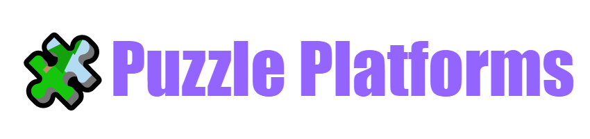

	

<h1 align="center">Puzzle Platforms</h1>

<h2>Overview</h2>
Demo multiplayer puzzle game based on ThirdPerson template with hosting, joining game sessions using Online Subsystem Steam API, and replication for moving platforms.

<h2>Prerequisites</h2>
<ul>
	<li>Unreal Engine 4.27.2
	<li><a href="https://store.steampowered.com/login/">Steam account</a>
	<li><a href="https://docs.unrealengine.com/4.27/en-US/ProgrammingAndScripting/Online/Steam/">Steamworks SDK</a>
	<li><a href="https://youtu.be/OjXTvY-PXxM">Set the same region in Steam with your partner</a>
</ul>

<h2>Demonstration</h2>
<h3>Hosting session</h2>
<h3>Join session</h2>
<h3>Gameplay</h2>

<h2>Controls</h2>
<ul>
	<li>W - move forward
	<li>S - move backward
	<li>A - move left
	<li>D - move right
	<li>P - pause game
	<li>Space - jump
</ul>

<h2>Known bugs</h2>
Did not find bugs

<h2>Try by yourself</h2>
You can download a zip file from <a href="https://psapronov.itch.io/puzzle-platform">itch.io</a> and play by yourself

<h2>License</h2>
Access to the sources of this project and their use are governed by the [Unreal Engine End User License Agreement](https://www.unrealengine.com/eula)